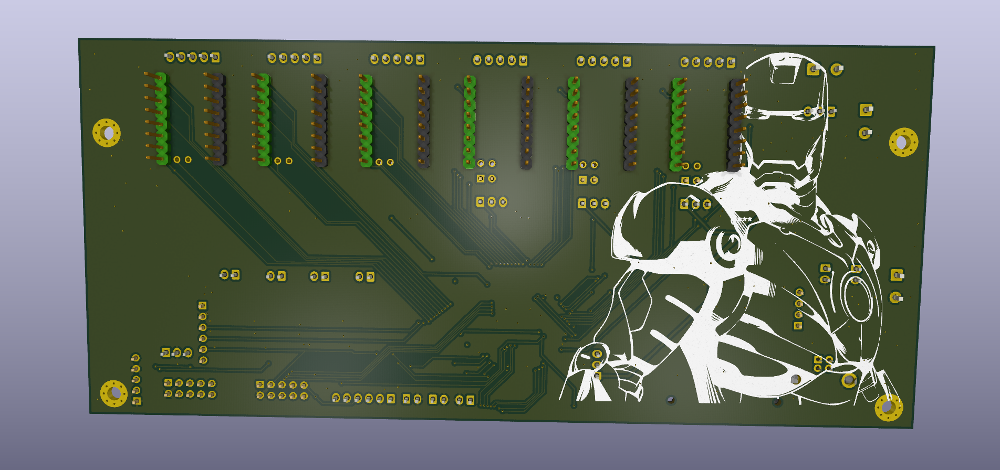
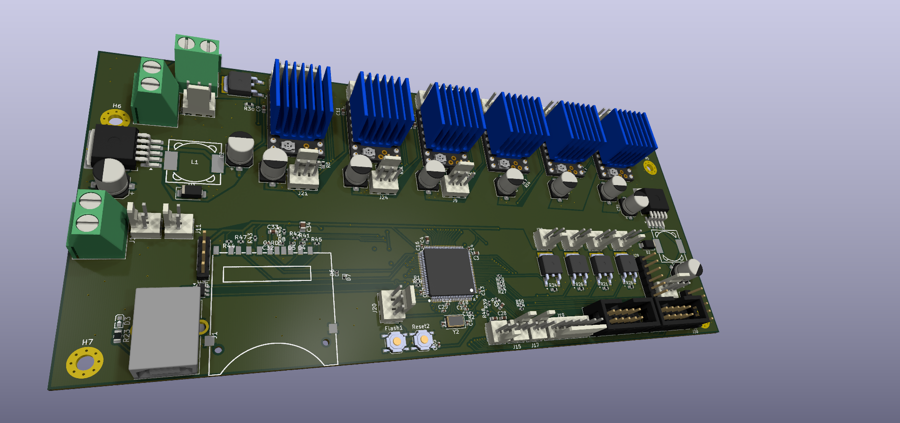
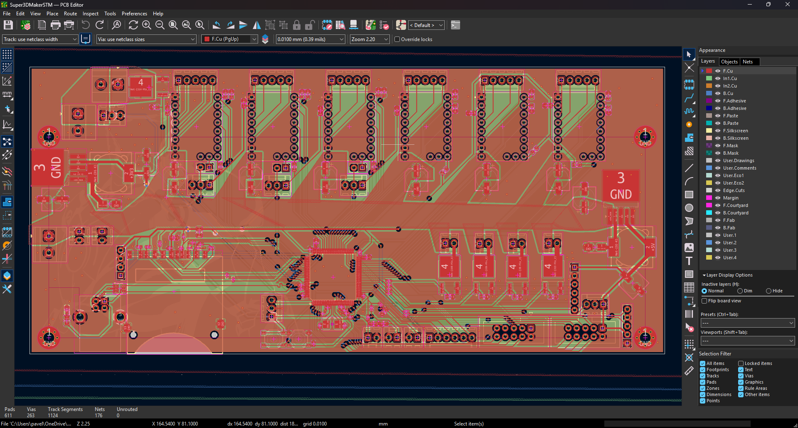
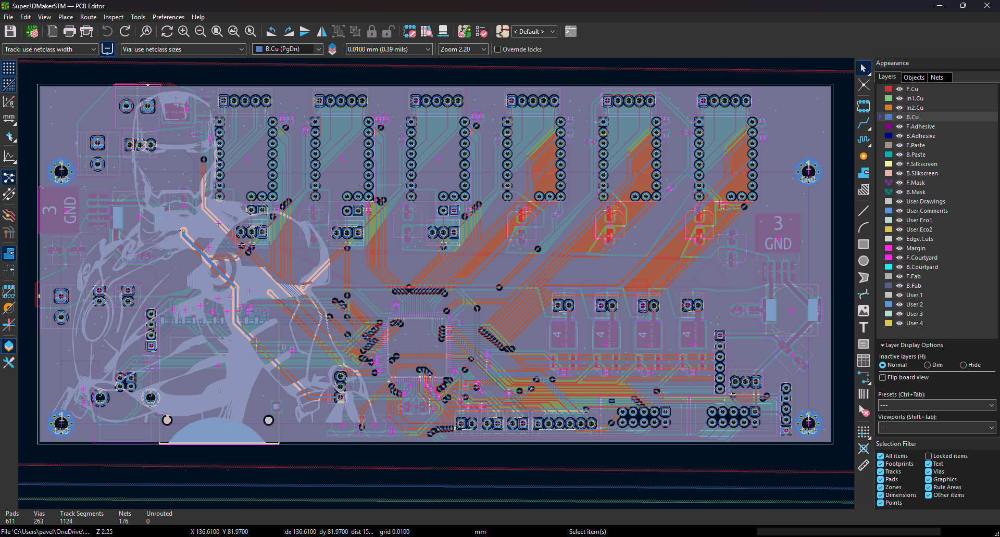
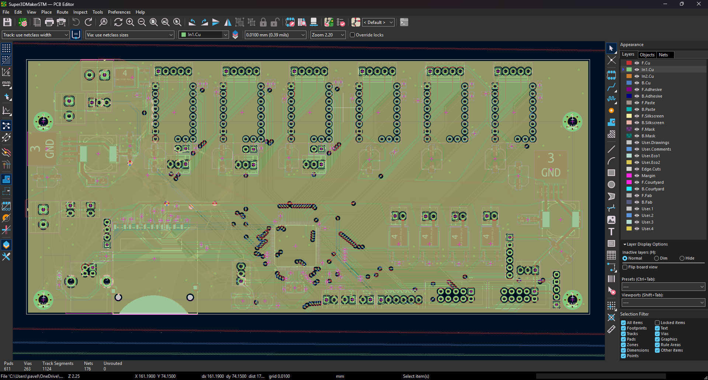
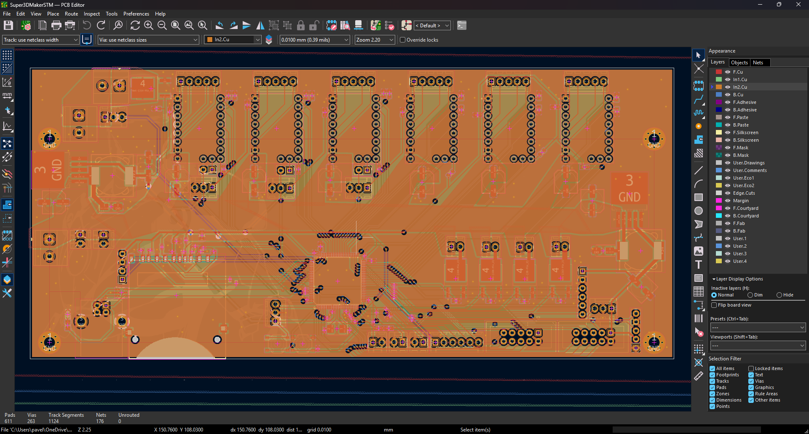
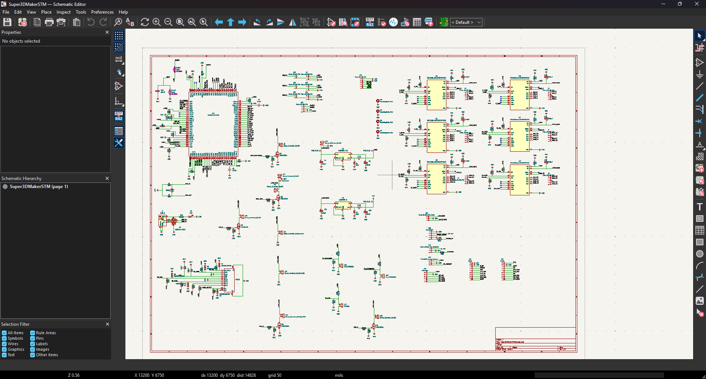

# Super3DMaker Controller Board

So first I want to explain, why I started this project. I had an old Profi3DMaker 3D printer at home, which was not used for a long time, mainly because of the hardware, which was just outdated. Because the printer had electronics probably from years like 2012 and older, it was my idea to bring it again to life, because the tech of 3D printing and electronics changed a lot. The 3D printer actually works, but does not stand a chance to modern machines which would be even cheaper based on the materials. Back in 2012, this printer was high-end and one of the most expensive 3D printers, you could get, because of the high quality aluminium frame, but because the technology changed so rapidly, it is just unreliable and prints items badly now, when compared to new 3d printers, which are also cheap. And because it is mainly and electronics issue, I realized that I could build my own new 3D printer board for this 3D printer and bring it again to life, so I started new Project.

The first stage was actually reverse-engineering the old board and studying as much possible of how modern 3d printers work.

A custom mainboard designed to replace the old electronics in my 3D printer. Built to handle klipper high speed kinematics and communicate directly with a Raspberry Pi Zero 2W. Designed entirely from scratch in KiCad 10.

## Project Features

* **Microcontroller:** STM32F407VET6 (100-pin, 32-bit ARM Cortex-M4)
* **Stackup:** 4-Layer PCB (Signal / GND / GND / Signal) for internal routing and better EMI shielding
* **Stepper Drivers:** 6x UART-controlled TMC2209 sockets
* **Power:** 24V main input with dual LM2596S buck converters (5V and 3.3V rails)
* **Connectivity:** USB-B for main communication, native Raspberry Pi UART interface
* **Displays:** Standard 10-pin IDC EXP1 and EXP2 headers for legacy 12864 or modern SPI BTT Mini12864 displays
* **Hardware Interlock:** Laser module power logically tied to the high-current heated bed circuit to prevent simultaneous power draw

* And more other...

## Gallery

### 3D PCB Render

### PCB Routing

### Schematic

---

## Bill of Materials (BOM)

| Component | Qty | Purpose / Description | Price (USD) | Link / Distributor |
| :--- | :---: | :--- | :--- | :--- |
| **Custom PCBA (Mainboard)** | 2 | Custom designed 4-layer STM32 controller board. Fully assembled via JLCPCB SMT (minus the THT USB-B connector which will be soldered manually to avoid mechanical case collisions). | ~$137.67 | JLCPCB - This is the price for 2 assembled boards to keep the price as low as possible. |
| **BIQU H2 V2S REVO** | 1 | Ultra-lightweight direct drive extrusion system with rapid-change nozzle capability. Replaces the current heavy toolhead, significantly reducing weight on the massive 400mm X-axis for faster, vibration-free printing. | $151.45 | [Allegro](https://allegro.cz/produkt/extruder-btt-biqu-h2-v2s-revo-direct-drive-1-75-mm-ce63ae7c-46b2-4eb6-95d3-a286495341f3?offerId=12801178318) |
| **ADXL345 3-Axis Accelerometer** | 2 | Essential for Klipper's Input Shaping calibration. It measures the physical resonance frequencies of the X and Y axes, allowing the firmware to actively cancel out vibrations during high-speed printing and eliminate ringing/ghosting on the printed parts. | $2.88 | [AliExpress](https://a.aliexpress.com/_EH7aAa2) |
| **CR-Touch (Auto Bed Leveling)** | 1 | Provides automatic high-precision mesh bed leveling. It compensates for any slight warping of the print bed and ensures a perfect first layer every time by measuring the distance between the nozzle and the build surface at multiple points. | $20.00 | [AliExpress](https://a.aliexpress.com/_EvwN6HC) |
| **BigTreeTech TMC2209 V1.3** | 6 | These are high-performance silent motor drivers required for the custom motherboard. They feature StealthChop technology for near-silent operation and StallGuard for sensorless homing, eliminating the need for physical limit switches. | $19.25 | [AliExpress](https://a.aliexpress.com/_EILgKrG) |
| **Raspberry Pi Zero 2W** | 1 | Serves as the main host computer for the custom 3D printer. It runs the Klipper firmware ecosystem and its web interface (Mainsail/Fluidd), performs heavy kinematics calculations, and sends precise hardware commands to the custom-designed STM32 motherboard via serial/USB connection. | $20.17 | [Rpishop](https://rpishop.cz/raspberry-pi-zero/4311-raspberry-pi-zero-2-w.html) |

### Mechanical and Assembly

| Item | Qty | Specification | Purpose |
| :--- | :---: | :--- | :--- |
| **Original Aluminum Case** | 1 | The heavy original printer chassis | I had to reverse engineer the mounting holes and connector distances, because I could not get the original CAD files. It was a nightmare but it fits within like 4.7mm of the board edge now. |
| **M3 Screws** | 4 | Standard mounting hardware | Securing the PCB to the chassis standoffs. |
- For the case of the 3d printer - Profi3DMaker case is used
